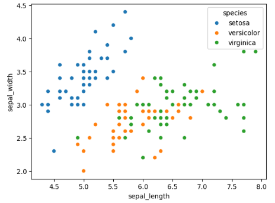
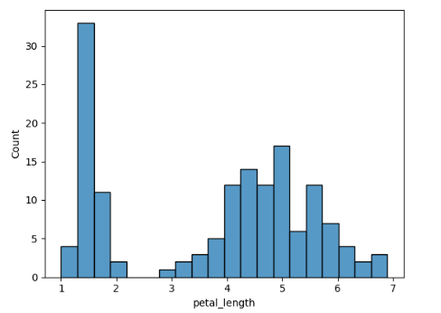
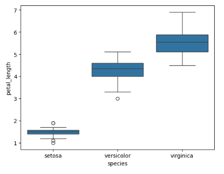

# Iris Dataset Analysis

## Task Objective
- Load and explore the Iris dataset.
- Understand relationships between variables.
- Visualize data using graphs.

## Approach
- Used **Python** with **pandas**, **matplotlib**, and **seaborn**.
- Loaded the dataset and checked its structure with `.shape`, `.columns`, and `.head()`.
- Created three types of visualizations:
  - **Scatter plot** → sepal length vs sepal width
  - **Histogram** → petal length distribution
  - **Box plot** → petal length by species

## Results
- Scatter plot shows species have different clusters.
- Histogram shows distribution of petal lengths.
- Box plot shows differences between species and highlights outliers.
- 
- 
- 
